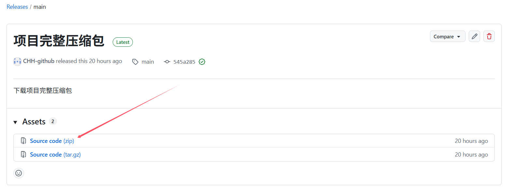
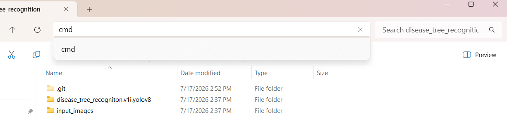
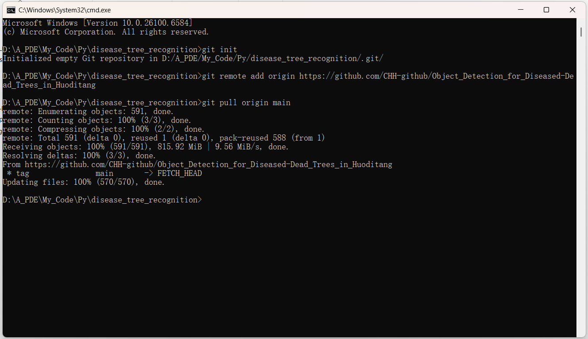

**智慧林业专业_火地塘森林病虫害实习_无人机遥感数据_病&死树目标检测(yolov8)**
===
## 一、将项目部署到本地（两种途径）
### 1.项目压缩包下载：
* 点击右侧**Releases 项目完整压缩包**\

* 任选其一下载\

### 2.用git链接到GitHub仓库，通过git部署项目文件
* 创建disease_tree_recognition文件夹并进入文件夹
* 打开终端/cmd并将路径设置到disease_tree_recognition文件夹下（cd）或者直接在资源管理器打开cmd

* 输入指令
    >git init\
    >git remote add origin https://github.com/CHH-github/Object_Detection_for_Diseased-Dead_Trees_in_Huoditang \
    >git pull origin main

## 二、环境配置
* 已将环境配置打包为environment.yml文件，在cmd（win系统）或者终端（Linux系统）执行
    > conda env create -f environment.yml
* 手动配置环境，会用到的命令
    > conda create -n <conda环境命名> python=3.12\
    > conda activate <conda环境名称>
    > conda install <库1> <库2>
* **重要补充**：如需安装带cuda的Pytorch
    首先通过nvidia-smi命令在cmd查询电脑支持的最高cuda版本
    在'https://pytorch.org/'下载cuda

## 三、代码简介及项目结构
- `input_images/`：存放待检测的原始无人机遥感影像。
- `output/`：检测结果输出目录。
- `runs/`：训练过程中生成的日志、权重文件和评估指标。
- `disease_tree_recogniton.v1i.yolov8/`：YOLO格式的数据集。
- `1_train.py` ~ `4_detect_large_image.py`：核心功能脚本。
    * 1_train.py：模型训练代码
    * 2_test_single.py：简单网页app搭建
    * 3_transform.py：图像转换代码
    * 4_detect_large_image.py：大图检测代码

## 四、分支策略
*  main 分支：稳定版本，存放经过验证的、可运行的代码。

## 五、常见问题（FAQ）
暂时没想到😁

## 六、项目贡献指南
